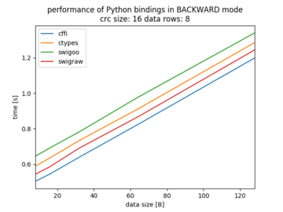

## ReverseCRC

Finding polynomial, init and xor values of CRC.


### Algorithms

Repository contains followint implementations of CRC:
* _DivisionCRC_ - standard shift register implementation,
* _HwCRC_ - implementation popular in hardware (according to Wikipedia),
* _ModCRC_ - implementation compatible with _crcmod_ library.

_DivisionCRC_ and _HwCRC_ have its backward versions which allows to find polynomials from input messages.


### Running

For run parameters execute `src/find.sh --help`

Running computation: `src/find.sh --file in.txt --outfile results.txt --mode BF_PAIRS --algo MOD`

Example of *in.txt* file:
```#comment
0020FCFF 11
0120FCFF 8C
0220FCFF 36
```
where first hex number in row is data and second number is calculated CRC.

#### Parameters

- *infile*: input file
- *mode*: operation mode:
    - *BF*: finding full key by forward algorithm (brute force)
    - *BF_PAIRS*: finding full key by forward algorithm using pair xoring (brute force)
    - *POLY*: find polynomials by xor-ing data pairs
    - *COMMON*: check common keys used in industry
    - *VERIFY*: verify found keys, simillar to *BF*
    - *BACKWARD*: reduces search space by one dimmension (of init registry values)
- *alg*: decode algorithm:
    - *HW* -- use *HwCRC*
    - *DIV* -- use *DivisionCRC*
    - *MOD* -- use *ModCRC*
- *mindsize*: Data size in frame, rest of frame will be treated as potential CRC field

Note: currently C implementation is used only for *HW* algorithm in conjunction with *BF*, *VERIFY* or *BACKWARD*.


#### Binding of *C* library

Application comes with fast version of algorithms, that is implemented in C. 
To use it it's needed to compile proper algorithms and then build Python bindings.

Building algorithms is done by executing `./src/fastcrc/clib/build.sh`

Using *ctypes* bindings does not require additional steps. In order to use *cffi* one has to execute `./src/fastcrc/cffi/build.py`. 
*Swig* binding goes in two configurations. First, *swigraw* intended to be as fast and as close to pure C as possible can be 
prepared by calling `./src/fastcrc/swigraw/build.sh`. The othre configuration, *swigoo* intended to be as convinient to use as 
object-oriented paradigm allows, can be prepared by calling `./src/fastcrc/swigoo/build.sh`


There is no more extra steps required to use prepared binding. It will be detected automatically in runtime. 
There is also possiblitity to enforce use of certain binding. It can be done by setting `FASTCRC_BINDING` env variable to one of following values:
- `auto` -- automatically select one of available bindings
- `ctypes` -- use *ctypes*
- `cffi` -- use *cffi*
- `swigraw` -- use *swigraw*
- `swigoo` -- use *swigoo*

For testing, following oneliner might be very handy: `FASTCRC_BINDING=cffi ./src/find.sh --mode BF --alg HW ...`

Note that, at the memoent, fast CRC is only implemented for *HW* algorithm.


#### Comparison of bindings

Following images show comparison of performance of implemented bindings.

[](doc/BF_db[8_16_32_64_128]_crc8_dr8_dgFF_sub.png)
[](doc/BACKWARD_db[8_16_32_64_128]_crc16_dr8_dgFF_sub.png)

*BF* task input:
- number of data rows: 8 (data frame and CRC pairs in input file)
- CRC size: 8 bits
- poly: each combination
- operation mode: *BF*

In this case there will be 256 * 8 calls to *C* library (independent of *data size*). Plot shows constant time differnce between bindings regardles of input size. Comparing to time needed to find CRC, the difference is negligibly small.


*BACKWARD* task input:
- number of data rows: 8 (data frame and CRC pairs in input file)
- CRC size: 16 bits
- poly: 0x1335D
- operation mode: *BACKWARD*

In this case there will be 65536 calls to *C* library. Three implementations perform almost equally, but *cffi* is significantly worse. Performance penalty of *cffi* is because of ability of the binding to 
automatic conversions of *Python* list structure to *C* raw arrays. For other binding it has to be done manually, thus can be precalculated and cached for repetitive use (as in this case).

 
### Development

Following techniques were used in the project:
* Unit testing 
* Code profiling (cProfile)
* Code coverage (Coverage.py)


#### Profiler

To run main application under code profiler (*cProfile*) use following script: `./tools/profiler.sh`, for example as follow:
`./tools/profiler.sh ./src/main.py {params}`.

Output file will be stored inside *out.prof* of *current working directory*. 


#### Code coverage

Executing application with code coverage can be done by following script: `./tools/coverage.sh`, for example `./tools/coverage.sh ./src/main.py {params}`.


### Various techniques

- *fastcrc* uses lookup tables to speed-up calculation
- lookup tables are automatically generated by additional scripts executed by CMake on demand (*add_custom_command*)
- *ctypes* Python module is used for binding C *fastcrc* library to speed-up CRC computation


### References

* https://en.wikipedia.org/wiki/Cyclic_redundancy_check - general description of CRC algorithm,
* https://en.wikipedia.org/wiki/Computation_of_cyclic_redundancy_checks - general description of CRC algorithm,
* http://www.sunshine2k.de/articles/coding/crc/understanding_crc.html - description of CRC algorithm,
* http://www.infradead.org/~mchehab/kernel_docs/unsorted/crc32.html - opimised shift register algorithm,
* http://www.cosc.canterbury.ac.nz/greg.ewing/essays/CRC-Reverse-Engineering.html - reverse engineering of CRC.
* binding C/C++ in Python -- https://realpython.com/python-bindings-overview/
